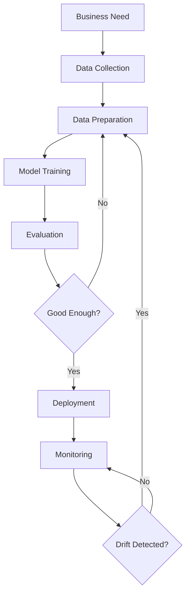

# 📊 AI/ML Lifecycle – Visual Diagram

```mermaid
graph TD
    A[Business Need] --> B[Data Collection]
    B --> C[Data Preparation]
    C --> D[Model Training]
    D --> E[Evaluation]
    E --> F{Good Enough?}
    F -- Yes --> G[Deployment]
    F -- No --> C
    G --> H[Monitoring]
    H --> I{Drift Detected?}
    I -- Yes --> C
    I -- No --> H
```

This diagram represents the iterative lifecycle of ML systems in production environments.
